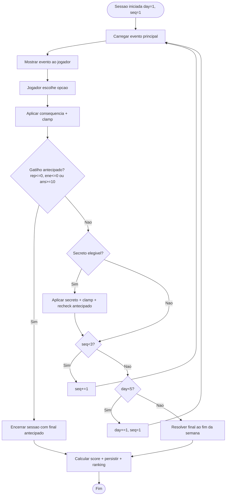

## Checkpoint obrigatório

- **Agent ativo:** Engine/Content + Architect/Documentation (cross-domain limitado a `docs/**` e `HANDOFF.md`/`PROJECT_STATUS.md`; nenhum código de produção).
- **Sprint ativa:** Sprint 1.0 — Regras críticas do jogo e contrato da engine.
- **Arquivos que pretendo ler (já lidos):** `README.md`, `PROJECT_STATUS.md`, `HANDOFF.md`, [`docs/00-start/sprint-plan.md`](docs/00-start/sprint-plan.md), [`docs/01-governance/agent-usage.md`](docs/01-governance/agent-usage.md), [`docs/01-governance/decisions.md`](docs/01-governance/decisions.md), [`docs/01-governance/cursor-workflow.md`](docs/01-governance/cursor-workflow.md), [`docs/02-product/architecture.md`](docs/02-product/architecture.md), [`docs/02-product/game-rules.md`](docs/02-product/game-rules.md), [`docs/02-product/api.md`](docs/02-product/api.md), [`docs/03-validation/sprint-history.md`](docs/03-validation/sprint-history.md), [`docs/03-validation/audits/sprint-0.3.md`](docs/03-validation/audits/sprint-0.3.md), [`desafio_trainees_cursor_v3.pdf`](desafio_trainees_cursor_v3.pdf), [`.cursor/rules/_dispatcher.mdc`](.cursor/rules/_dispatcher.mdc), [`.cursor/rules/game-engine.mdc`](.cursor/rules/game-engine.mdc), [`.cursor/rules/docs-sync.mdc`](.cursor/rules/docs-sync.mdc), [`scripts/audit.ps1`](scripts/audit.ps1), [`scripts/audit.sh`](scripts/audit.sh).
- **Arquivos que pretendo criar/alterar:**
  - Alterar [`docs/02-product/game-rules.md`](docs/02-product/game-rules.md)
  - Alterar [`docs/01-governance/decisions.md`](docs/01-governance/decisions.md)
  - Alterar [`docs/00-start/sprint-plan.md`](docs/00-start/sprint-plan.md)
  - Alterar `PROJECT_STATUS.md`
  - Alterar `HANDOFF.md`
  - Alterar [`docs/03-validation/sprint-history.md`](docs/03-validation/sprint-history.md) (adicionar linha 1.0)
  - Criar `docs/03-validation/audits/sprint-1.0.md`
- **Arquivos proibidos:** `backend/**`, `frontend/**`, qualquer `engine/`, qualquer `events.json`, `scripts/*.ps1`/`*.sh`, `.cursor/rules/*.mdc`, `.env*`, `package*.json`, `pyproject.toml`.
- **O que NÃO será implementado:** engine, `events.json`, código backend, código frontend, API, banco, jogo, healthchecks; também sem criar Skills formais do Cursor nem declarar uso delas.
- **Riscos:**
  - R1 — Conflito com texto literal do desafio ("algum atributo chega a zero"). Mitigação: ADR explicita justificativa de restringir gatilhos antecipados a 3 atributos críticos e mapeia os 3 restantes para predicados de final ao fim do dia 5.
  - R2 — Divergência entre os predicados antecipados e os predicados existentes em `game-rules.md` §3. Mitigação: documentar que predicados antecipados convivem com predicados de fim de semana e definir prioridade explícita.
  - R3 — Audit `audit.ps1` falhar se algum arquivo da lista for renomeado/movido por engano. Mitigação: nenhuma edição muda nomes/locais — só conteúdo.
  - R4 — Cruzar domínio para código. Mitigação: zero edição em `backend/`, `frontend/`, rules ou scripts.
- **Plano curto:** decidir formalmente (texto) → atualizar `game-rules.md` (§4.4 deixa de ser pendente; surge §11 com responsabilidades) → fechar ADR-007 e abrir ADR-010 → adicionar Sprint 1.1 ao sprint-plan → atualizar PROJECT_STATUS/HANDOFF/sprint-history → criar relatório `sprint-1.0.md` → rodar `audit.ps1`.
- **Definition of Done:**
  - Regra de fim de jogo (normal + antecipado) documentada em `game-rules.md`.
  - ADR-007 fechada (com `Status: Substituída`) e ADR-010 nova `Aceita` com a decisão.
  - Mapeamento explícito gatilho antecipado → final aplicado.
  - Responsabilidades engine/backend/frontend listadas.
  - Próxima sprint **1.1 — Engine skeleton + schema events.json** definida em `sprint-plan.md`.
  - `powershell -ExecutionPolicy Bypass -File scripts/audit.ps1` retorna `OK - governanca minima presente e raiz limpa.`
  - Nenhum arquivo fora de `docs/**`, `PROJECT_STATUS.md`, `HANDOFF.md` foi alterado.

---

## Decisões formais a registrar (resumo)

1. **Fim normal de jogo:** após **15 eventos principais** (5 dias × 3). Eventos secretos não consomem slot principal.
2. **Final antecipado existe** e dispara ao final da aplicação de consequências de qualquer evento (principal ou secreto), após clamp:
   - `reputacao <= 0` → final `demitido` (antecipado).
   - `energia <= 0` → final `burnout` (antecipado, esgotamento físico).
   - `ansiedade >= 10` → final `burnout` (antecipado, esgotamento psicológico).
   - `produtividade <= 0`, `aprendizado <= 0`, `networking <= 0` **NÃO** disparam fim antecipado; influenciam predicados de final ao fim do dia 5 (`risco_op`, `invisivel`).
3. **Ordem de avaliação:** a checagem de gatilho antecipado roda imediatamente após `clamp`, antes de avançar `sequence/day`. Se múltiplos gatilhos disparam no mesmo passo, prioridade: `reputacao<=0` > `energia<=0` > `ansiedade>=10`.
4. **Destaque da equipe** (`trainee_lenda` / `promessa`) é final positivo avaliado **apenas** ao fim do dia 5 — nunca antecipado.
5. **Eventos secretos:** opcionais, dependem do estado/histórico, injetados entre principais, não consomem slot principal (alinhado a `game-rules.md` §4.2).
6. **Ranking** registra **toda** sessão finalizada, inclusive antecipada (mesmo `compute_score` definido em `game-rules.md` §8).
7. **Responsabilidades:**
   - **Engine** (Python puro): carregar evento atual, validar opção, aplicar consequência, clamp, detectar final antecipado, avançar `day/sequence`, calcular final e score; **nunca** importar React/FastAPI/SQLAlchemy.
   - **Backend** (FastAPI + SQLAlchemy): persistir estado, chamar a engine, validar sessão/payload, salvar decisões, expor API.
   - **Frontend** (React/Vite/TS): exibir estado, enviar escolhas, mostrar feedback; **nunca** calcula score/final/consequência oficial.

### Fluxo (mermaid)



---

## Edições por arquivo

### 1. [`docs/02-product/game-rules.md`](docs/02-product/game-rules.md)

- **§4.4 — Final antecipado: pendente (ADR-007)** → reescrever como **§4.4 — Final antecipado (decisão definitiva, ADR-010)** com:
  - Existência confirmada.
  - Os 3 gatilhos (`reputacao<=0`, `energia<=0`, `ansiedade>=10`).
  - Mapeamento explícito gatilho → final aplicado.
  - Justificativa para `produtividade/aprendizado/networking` **não** dispararem antecipado.
  - Ordem de avaliação (rep > ene > ans) e momento da checagem (após clamp).
  - Nota: `compute_score` (§8) funciona igual em final antecipado, com `days_completed` parcial.
- Adicionar **§11 — Responsabilidades por camada** com tabela engine/backend/frontend (espelha `architecture.md` mas com foco no fluxo da sessão).
- Adicionar nota em **§3** indicando que a tabela de finais de fim de semana coexiste com finais antecipados (sem alterar predicados existentes).
- Adicionar item em **§4.3 (`validate_events`)** sobre coerência de IDs de finais antecipados (`demitido`, `burnout`) já existirem no registry.

### 2. [`docs/01-governance/decisions.md`](docs/01-governance/decisions.md)

- **ADR-007** → mudar `Status` para **Substituída por ADR-010**, manter contexto histórico, adicionar pointer.
- **Nova ADR-010 — Final antecipado por atributo crítico** com:
  - Status: **Aceita**, Data: 2026-05-14.
  - Contexto: enunciado pede "atributo zerado/burnout/demissão"; precisamos de regra unívoca antes da Sprint 1.1.
  - Decisão: 3 gatilhos antecipados conforme acima; demais atributos só influenciam predicados ao fim do dia 5.
  - Consequências: engine deve implementar checagem após clamp; ranking recebe sessões antecipadas; UX precisa preparar telas de fim antecipado em sprint futura de UX.
- Atualizar a seção **"Pendências de ADR"** removendo o item de final antecipado (resolvido) e mantendo as duas pendências restantes (deploy/CORS, logs/PII).

### 3. [`docs/00-start/sprint-plan.md`](docs/00-start/sprint-plan.md)

- Logo após a seção atual **"Sprint 1 — Engine + catálogo"**, inserir bloco mais detalhado:

```markdown
## Sprint 1.0 — Regras críticas do jogo e contrato da engine ✅
- DoD: regras documentadas em `docs/02-product/game-rules.md` §4.4/§11; ADR-007 fechada; ADR-010 aceita; relatório em `docs/03-validation/audits/sprint-1.0.md`; `audit.ps1` passa.
- Fora de escopo: código.

## Sprint 1.1 — Engine skeleton + schema `events.json`
- Objetivo: criar `backend/engine/` (Python puro) com tipos imutáveis de estado/evento/opção, função `validate_events()` esqueleto e contrato de carregamento JSON; criar `backend/engine/data/events.json` mínimo (placeholder validável).
- DoD:
  - [ ] `backend/engine/` existe e respeita `.cursor/rules/game-engine.mdc` (sem FastAPI/SQLAlchemy).
  - [ ] Tipos para `State`, `Event`, `Option`, `Consequences`, `EarlyEndingTrigger`.
  - [ ] `validate_events()` cobre invariantes 1–10 de `game-rules.md` §9.
  - [ ] Testes unitários iniciais para validador.
  - [ ] Relatório em `docs/03-validation/audits/sprint-1.1.md`.
- Fora de escopo: API, persistência, UI, conteúdo final dos 15 eventos.
```

(O bloco antigo "Sprint 1 — Engine + catálogo" passa a ser uma sprint posterior — Sprint 1.2 — focada em escrever o conteúdo dos 15 + 2 eventos.)

### 4. `PROJECT_STATUS.md`

- Atualizar **Sprint atual** para `Sprint 1.0 — Regras críticas do jogo (fechada tecnicamente)`.
- Em **Pendências Bloqueantes**, remover "Decisão sobre final antecipado..." (resolvida) e adicionar "Aceite humano da Sprint 1.0".
- Em **Próximo Passo**, apontar para Sprint 1.1.

### 5. `HANDOFF.md`

- Substituir bloco **Estado atual** com nota da Sprint 1.0 fechada documentalmente.
- Em **Próximo passo recomendado**, trocar "Não iniciar Sprint 1 sem checkpoint" por "Após aceite humano de 1.0, abrir Sprint 1.1 (engine skeleton + schema)".
- Em **Pendências abertas**, remover linha "Final antecipado (ADR)".
- Adicionar entrada em **Última alteração neste arquivo** seguindo template de `cursor-workflow.md` (Agent Engine/Content + Architect/Documentation, arquivos tocados, evidência `audit.ps1`).

### 6. [`docs/03-validation/sprint-history.md`](docs/03-validation/sprint-history.md)

- Adicionar linha:

```markdown
| **1.0** | Regras criticas do jogo + contrato da engine (final antecipado decidido) | Fechada tecnicamente | Atualizacoes em game-rules.md, decisions.md (ADR-010), sprint-plan.md | [`sprint-1.0.md`](audits/sprint-1.0.md) |
```

- Em **Pendências transversais**, remover qualquer referência a "final antecipado pendente".

### 7. Criar `docs/03-validation/audits/sprint-1.0.md`

Seguir o mesmo template do `sprint-0.3.md`:
1. Resumo executivo.
2. Escopo aprovado (apenas docs).
3. Fora de escopo (código de produto, Skills formais, alterações em rules).
4. Agent / Rules / Skills (com a frase obrigatória **"Skills formais não utilizadas nesta sprint"**).
5. Evidências técnicas (lista de arquivos editados; saída de `audit.ps1`).
6. Limitações conhecidas (decisão restringe gatilhos antecipados a 3 atributos — justificada em ADR-010).
7. Validação documental (par game-rules ↔ decisions ↔ sprint-plan consistente).
8. Critério de aceite aplicado.
9. Pendências (aceite humano; abrir Sprint 1.1).
10. Decisão de aceite humano (pendente).

---

## Validação final

```powershell
powershell -ExecutionPolicy Bypass -File scripts/audit.ps1
```

Resultado esperado: `OK - governanca minima presente e raiz limpa.` (todas as edições preservam nomes e locais dos arquivos exigidos pelo audit; nenhum arquivo proibido foi tocado).