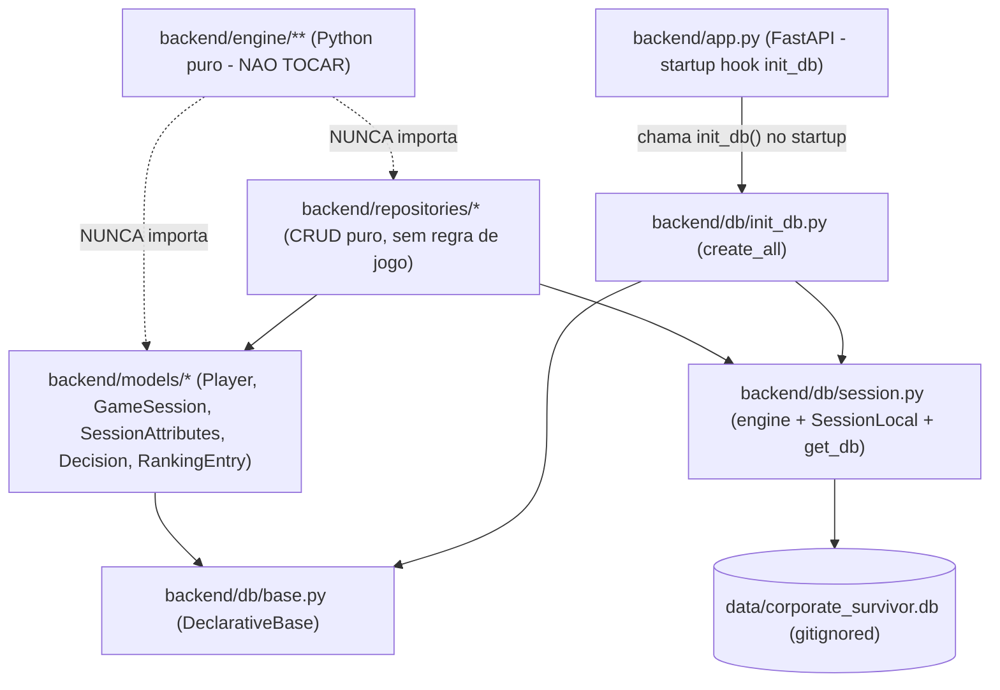

## Sprint 2.0 — Persistência SQLite + modelos base (Agent Backend)

Atuando como **Agent Backend**. Sprint não-listada formalmente no plano até agora — esta sprint introduz "Sprint 2.0" e renomeia a antiga "Sprint 2 — Robustez API" para "Sprint 2.1" (decisão do humano: patch mínimo cross-domain). Decisão de migrations: usar `Base.metadata.create_all()` conforme ADR-006 (fallback aceito).

### Estratégia em uma frase

Criar `backend/db/`, `backend/models/`, `backend/repositories/` desacoplados da engine, sem regra de jogo, sem endpoints novos, com testes de persistência usando SQLite in-memory.

### Camadas e responsabilidades



### Arquivos — criados

- [`backend/db/__init__.py`](backend/db/__init__.py) — reexporta `Base`, `engine`, `SessionLocal`, `get_db`, `init_db`.
- [`backend/db/base.py`](backend/db/base.py) — `class Base(DeclarativeBase): pass`.
- [`backend/db/session.py`](backend/db/session.py) — engine SQLAlchemy a partir de `os.environ.get("DATABASE_URL", "sqlite:///./data/corporate_survivor.db")`; `SessionLocal = sessionmaker(...)`; `get_db()` generator (`yield session` + close).
- [`backend/db/init_db.py`](backend/db/init_db.py) — `def init_db() -> None: Base.metadata.create_all(bind=engine)` (importa os modelos para registrar metadata).
- [`backend/models/__init__.py`](backend/models/__init__.py) — reexporta `Player`, `GameSession`, `SessionAttributes`, `Decision`, `RankingEntry`.
- [`backend/models/player.py`](backend/models/player.py) — `id Int PK`, `name String(64) NOT NULL` (index), `created_at DateTime server_default=func.now()`. Relacionamento `sessions: list[GameSession]`.
- [`backend/models/game_session.py`](backend/models/game_session.py) — `id`, `player_id FK->players.id NOT NULL` (index), `status String(16) default='active'` (`active|finished`), `current_day Int default=1`, `current_sequence Int default=1`, `current_event_id String NULLABLE`, `ending_id String NULLABLE`, `score Int NULLABLE`, `created_at`, `updated_at` (`onupdate=func.now()`), `finished_at DateTime NULLABLE`. Relacionamentos: `player`, `attributes` (1:1 via `uselist=False`), `decisions`.
- [`backend/models/session_attributes.py`](backend/models/session_attributes.py) — `session_id FK->sessions.id PK` (1:1), 6 colunas `Int NOT NULL` com defaults dos atributos iniciais do jogo (`energia=7, reputacao=5, networking=3, ansiedade=2, produtividade=5, aprendizado=4`).
- [`backend/models/decision.py`](backend/models/decision.py) — `id`, `session_id FK NOT NULL` (index), `event_id String NOT NULL`, `option_id String(1) NOT NULL`, `day Int NOT NULL`, `sequence Int NOT NULL`, `created_at server_default=func.now()`.
- [`backend/models/ranking_entry.py`](backend/models/ranking_entry.py) — `id`, `player_name String(64) NOT NULL`, `score Int NOT NULL` (index `desc`), `ending_id String NOT NULL`, `session_id FK NOT NULL`, `created_at`.
- [`backend/repositories/__init__.py`](backend/repositories/__init__.py).
- [`backend/repositories/player_repository.py`](backend/repositories/player_repository.py) — `create(db, name)`, `get(db, id)`, `get_by_name(db, name)`. **Apenas CRUD**, sem validação de regex/normalização (fica para Sprint 2.1).
- [`backend/repositories/session_repository.py`](backend/repositories/session_repository.py) — `create(db, player_id)` (cria sessão + `SessionAttributes` iniciais em uma transação), `get(db, id)`, `update_progress(db, id, day, sequence, event_id)`, `finish(db, id, ending_id, score)`. Nada de cálculo: recebe valores prontos.
- [`backend/repositories/attributes_repository.py`](backend/repositories/attributes_repository.py) — `get(db, session_id)`, `update(db, session_id, attrs_dict)`. Sem clamp (clamp é da engine).
- [`backend/repositories/decision_repository.py`](backend/repositories/decision_repository.py) — `record(db, session_id, event_id, option_id, day, sequence)`, `list_by_session(db, session_id)`.
- [`backend/repositories/ranking_repository.py`](backend/repositories/ranking_repository.py) — `add(db, player_name, score, ending_id, session_id)`, `top_n(db, n=10)`.
- [`backend/data/.gitkeep`](backend/data/.gitkeep) — preserva pasta runtime; o `.db` em si já está em `.gitignore` (`*.db`, `backend/data/*.db`).
- [`backend/tests/conftest.py`](backend/tests/conftest.py) — fixtures `engine_test` (SQLite in-memory com `StaticPool` para compartilhar conexão entre threads) e `db` (session por teste com rollback no teardown). Cria tabelas via `Base.metadata.create_all(engine_test)`.
- Testes (5 arquivos, ~12–18 testes no total): `test_db_setup.py`, `test_player_repository.py`, `test_session_repository.py`, `test_attributes_repository.py`, `test_decision_repository.py`, `test_ranking_repository.py`.
- [`docs/03-validation/audits/sprint-2.0.md`](docs/03-validation/audits/sprint-2.0.md) — relatório de aceite (modelo conforme `sprint-1.1.md` e `sprint-1.2.md`).

### Arquivos — alterados

- [`backend/pyproject.toml`](backend/pyproject.toml) — adicionar `"sqlalchemy>=2.0"` em `dependencies`. Versão `pyproject` revalidada via `pip install -e ".[dev]"`.
- [`backend/app.py`](backend/app.py) — adicionar startup hook minimalista (lifespan/event) chamando `init_db()`. **Sem novos endpoints.**

```python
# backend/app.py — esboço da mudança
from contextlib import asynccontextmanager
from fastapi import FastAPI
from db import init_db

@asynccontextmanager
async def lifespan(app: FastAPI):
    init_db()
    yield

app = FastAPI(title="Corporate Survivor API", lifespan=lifespan)

@app.get("/api/health")
def health() -> dict[str, str]:
    return {"status": "ok"}
```

- [`docs/00-start/sprint-plan.md`](docs/00-start/sprint-plan.md) — **patch mínimo cross-domain (autorizado pelo humano):** inserir bloco "Sprint 2.0 — Persistência SQLite + modelos base" antes da antiga "Sprint 2", e renomear "Sprint 2 — Robustez API" para "Sprint 2.1 — Robustez API". Nada além disso.
- [`PROJECT_STATUS.md`](PROJECT_STATUS.md) — refletir Sprint 2.0 em execução.
- [`HANDOFF.md`](HANDOFF.md) — nova sessão Backend/Sprint 2.0; declarar patch cross-domain em `sprint-plan.md`.
- [`docs/03-validation/sprint-history.md`](docs/03-validation/sprint-history.md) — adicionar linha da Sprint 2.0.
- [`.env.example`](.env.example) — já contém `DATABASE_URL`; **só revisar**. Provavelmente nenhuma alteração.
- [`.gitignore`](.gitignore) — já cobre `*.db`/`backend/data/*.db`; **só revisar**. Provavelmente nenhuma alteração.
- [`docs/02-product/api.md`](docs/02-product/api.md) — **só se necessário**. Texto atual já marca endpoints de jogo como "planejado para sprints futuras". Possivelmente diff zero; se houver, apenas reforçar que persistência SQLite existe mas não está exposta via HTTP.

### Arquivos proibidos (NÃO tocar)

- `backend/engine/**` (Engine/Content), `backend/engine/data/events.json`, `frontend/**`, `.cursor/rules/**`, `scripts/**`, `docs/02-product/game-rules.md`, `docs/01-governance/decisions.md` (ADR-006 já cobre — apenas citar), `docs/01-governance/agent-usage.md`, `docs/01-governance/cursor-workflow.md`, `docs/00-start/executive-overview.md` (dossiê fica para Sprint 2.0-A documental), `README.md`, `docs/00-start/setup-company-env.md`, `_context/**`.

### Invariantes e proibições explícitas no código

- Nenhum módulo em `backend/db/**`, `backend/models/**`, `backend/repositories/**` importa `backend/engine/**`. A conversão State (engine) ↔ ORM, **se necessária**, fica numa função utilitária no repositório, recebendo dicionário de atributos — não importa `engine.types.Attributes` nesta sprint (evita acoplamento e fica explícito que repository é CRUD).
- Nenhum repository chama `compute_score`, `apply_choice`, `resolve_ending` ou aplica `clamp`.
- Nenhum endpoint novo. `backend/app.py` ganha apenas o lifespan com `init_db()`.
- Models não calculam score, não decidem final, não aplicam consequência.

### Decisão sobre migrations (registrar em sprint-2.0.md)

Conforme ADR-006: `Base.metadata.create_all(bind=engine)` no startup. Justificativa nesta sprint: escopo limitado, sem mudanças de schema esperadas, ambiente corporativo onde Alembic adicionaria fricção. Alembic pode ser reavaliado se as próximas sprints introduzirem migrations destrutivas.

### Validação obrigatória

```powershell
cd backend
.\.venv\Scripts\Activate.ps1
pip install -e ".[dev]"
.\.venv\Scripts\python.exe -m pytest tests/ engine/tests/ -v
```

Esperado: 44 testes pré-existentes (1 healthcheck + 43 engine) **+** ~12–18 novos testes de persistência, **todos verdes**.

Em paralelo, fora de `backend/`:

```powershell
powershell -ExecutionPolicy Bypass -File scripts/audit.ps1
```

Esperado: exit code 0, mensagem `OK - governanca minima presente e raiz limpa.`.

### Definition of Done

- [ ] SQLAlchemy 2.0 adicionado a [`backend/pyproject.toml`](backend/pyproject.toml) e instalável via `pip install -e ".[dev]"`.
- [ ] Pacote `backend/db/` (Base, engine, SessionLocal, get_db, init_db) criado.
- [ ] 5 modelos com **exatamente** os campos do enunciado, FKs íntegras, server defaults coerentes.
- [ ] 5 repositories com CRUD puro — sem regra de jogo, sem clamp, sem `compute_score`.
- [ ] `backend/app.py` com lifespan chamando `init_db()`; `/api/health` segue verde.
- [ ] `backend/data/.gitkeep` presente; `.gitignore` cobre `.db` (já cobre).
- [ ] Testes de persistência verdes (in-memory) **+** healthcheck verde **+** 43 engine verdes = suite cresce sem regressão.
- [ ] `scripts/audit.ps1` → exit 0.
- [ ] Nenhum import cruzado entre `backend/engine/**` e `backend/{db,models,repositories}/**`.
- [ ] [`docs/03-validation/audits/sprint-2.0.md`](docs/03-validation/audits/sprint-2.0.md) criado com: agent declarado, rules, skills ("Skills formais não utilizadas nesta sprint"), evidências (output pytest + audit.ps1), decisão ADR-006 explícita, arquivos proibidos não tocados, pendências (Sprint 2.1, Sprint 2.0-A documental).
- [ ] [`docs/00-start/sprint-plan.md`](docs/00-start/sprint-plan.md): bloco "Sprint 2.0" inserido + antiga "Sprint 2" renomeada para "Sprint 2.1". Justificativa cross-domain declarada no HANDOFF.
- [ ] [`PROJECT_STATUS.md`](PROJECT_STATUS.md), [`HANDOFF.md`](HANDOFF.md), [`docs/03-validation/sprint-history.md`](docs/03-validation/sprint-history.md) atualizados refletindo a Sprint 2.0.

### Riscos remanescentes (declarados)

1. **Dossiê executivo desatualizado.** Após patch no sprint-plan, [`docs/00-start/executive-overview.md`](docs/00-start/executive-overview.md) §7/§8/§10 ficará desalinhado (cita "Sprint 2 — Robustez API"). Solução: **Sprint 2.0-A documental** (Architect/Documentation, depois da aceitação humana desta sprint).
2. **`StaticPool` para SQLite in-memory** é necessário para que testes que abrem múltiplas sessões compartilhem a mesma conexão e enxerguem o mesmo schema. Mitigação: documentar a escolha em `conftest.py` e usar o pattern recomendado pelo SQLAlchemy 2.0.
3. **Mismatch de PYTHONPATH nos testes.** Hoje `backend/tests/test_health.py` faz `from app import app` (cwd-relative). Os novos testes farão `from db import ...`, `from models import ...`, `from repositories import ...` — funciona pelo mesmo mecanismo (cwd=backend ao rodar pytest). Confirmar com pytest da raiz `backend/`. Se falhar, criar `conftest.py` no nível `backend/` injetando o path.