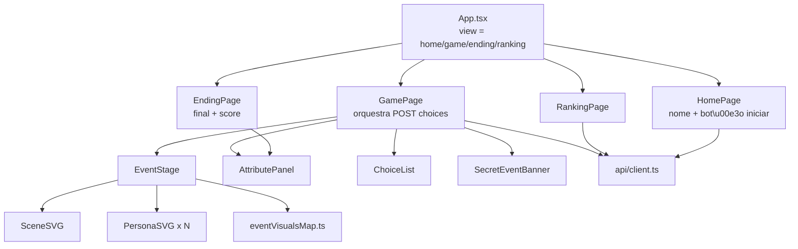

# Sprint 3.0 — Frontend jogável mínimo com palco visual

## Checkpoint obrigatório

- **Agent ativo:** Frontend.
- **Sprint ativa:** 3.0 — UX jogável mínima com diferencial visual.
- **Stack confirmada:** React 19 + TypeScript 6 + Vite 8 já presentes; **plain CSS + CSS variables** (sem Tailwind, sem `@fontsource`, sem `lucide`, sem `lottie`); **navegação por estado** (sem `react-router`); SVGs escritos como **componentes `.tsx`** (sem `vite-plugin-svgr`); fetch nativo (sem TanStack Query).
- **Arquivos lidos:** `README.md`, `PROJECT_STATUS.md`, `HANDOFF.md`, [`docs/02-product/api.md`](docs/02-product/api.md), [`docs/02-product/architecture.md`](docs/02-product/architecture.md), [`docs/02-product/game-rules.md`](docs/02-product/game-rules.md), [`docs/00-start/sprint-plan.md`](docs/00-start/sprint-plan.md), [`docs/01-governance/agent-usage.md`](docs/01-governance/agent-usage.md), [`.cursor/rules/_dispatcher.mdc`](.cursor/rules/_dispatcher.mdc), [`.cursor/rules/frontend.mdc`](.cursor/rules/frontend.mdc), [`frontend/package.json`](frontend/package.json), [`frontend/src/App.tsx`](frontend/src/App.tsx), [`frontend/src/main.tsx`](frontend/src/main.tsx), [`frontend/src/index.css`](frontend/src/index.css), [`frontend/src/App.css`](frontend/src/App.css), [`frontend/vite.config.ts`](frontend/vite.config.ts), [`frontend/tsconfig.app.json`](frontend/tsconfig.app.json), [`frontend/eslint.config.js`](frontend/eslint.config.js), [`frontend/index.html`](frontend/index.html), [`backend/schemas/sessions.py`](backend/schemas/sessions.py) (somente leitura para entender o shape real do `SessionResponse`), [`Referencia_front_RPG/SKILL.md`](Referencia_front_RPG/SKILL.md), [`Referencia_front_RPG/style-guide.md`](Referencia_front_RPG/style-guide.md), [`Referencia_front_RPG/asset-pipeline.md`](Referencia_front_RPG/asset-pipeline.md), [`Referencia_front_RPG/event-visuals-map.md`](Referencia_front_RPG/event-visuals-map.md), [`Referencia_front_RPG/personas.md`](Referencia_front_RPG/personas.md), [`Referencia_front_RPG/scenes.md`](Referencia_front_RPG/scenes.md).
- **Arquivos proibidos (não tocar):** `backend/**`, `backend/engine/**`, `backend/engine/data/events.json`, `.cursor/rules/**`, `scripts/**`, `docs/02-product/**`, `docs/01-governance/**`, `docs/00-start/**`, `_context/**`, `Referencia_front_RPG/**` (somente leitura).
- **O que NÃO será implementado (intencional):** `apply_secret_choice` / fluxo completo de evento secreto (só banner discreto), `POST /restart`, `POST /continue`, Lottie, cálculo de score/final no cliente, hardcode de eventos do catálogo, route por URL, autenticação, paginação do ranking, indicação "Sua posição: N" no ranking (não há endpoint), assets finais (só placeholders geométricos), evolução visual da Sprint 4.
- **Riscos identificados:**
  - **API não retorna `visuals` no `EventPayload`** (verificado em [`backend/schemas/sessions.py`](backend/schemas/sessions.py)). Solução: mapeamento `event_id → { scene, personas[] }` **isolado em camada visual do frontend** (`assets/visuals/eventVisualsMap.ts`), nunca em routers/regras de jogo. Fallback `_default` quando `event_id` desconhecido.
  - **`current_event.day` pode ser `null` em secreto** (schema `EventPayload` permite). Componente `EventStage` deve aceitar `day`/`sequence` ausentes sem quebrar.
  - **Sessão pré-existente no `localStorage`** pode estar deletada no DB (reset local). Tratar `404` no `GET /api/sessions/{id}` limpando `localStorage` silenciosamente.
  - **CORS atual** permite `Content-Type` + `Accept` apenas; toda chamada usa esses headers — não inventar `Authorization` ou outros.
  - **Vite dev proxy** já mapeia `/api → http://localhost:8000` — produção precisará de `VITE_API_BASE_URL` (ficará anotado, mas só **dev** é DoD da Sprint 3).
- **Plano curto (alto nível):**
  1. Estender [`frontend/src/index.css`](frontend/src/index.css) com paleta + tipografia do `style-guide.md` via CSS variables.
  2. Criar camada de API (`api/types.ts`, `api/client.ts`) espelhando exatamente o `SessionResponse` real do backend, sem `consequences`.
  3. Criar camada visual (`assets/visuals/`) com 7 personas + 8 cenas como **componentes React**, mapeamento por `event_id`, anchors, ícones SVG dos 6 atributos.
  4. Criar componentes UI atômicos (`EventStage`, `SceneSVG`, `PersonaSVG`, `AttributePanel`, `ChoiceList`, `SecretEventBanner`, `RankingPanel`, `EndingView`).
  5. Criar páginas (`HomePage`, `GamePage`, `EndingPage`, `RankingPage`) e orquestração de navegação em `App.tsx`.
  6. Microanimação CSS de feedback nos atributos + `prefers-reduced-motion` em arquivo dedicado.
  7. Documentar: criar `docs/03-validation/audits/sprint-3.0.md`, atualizar `HANDOFF.md`, `PROJECT_STATUS.md`, `docs/03-validation/sprint-history.md`.
- **Definition of Done (Sprint 3.0):**
  - [ ] `npm install` em `frontend/` finaliza sem erro novo.
  - [ ] `npm run typecheck` exit 0.
  - [ ] `npm run build` exit 0 (gera `dist/` válido).
  - [ ] `npm run lint` sem erros novos (warnings tolerados se pré-existentes).
  - [ ] Com backend rodando (`uvicorn app:app --port 8000`), o fluxo `Home → criar player → criar sessão → escolher opção em 15 eventos → tela de final → voltar para ranking` funciona ponta-a-ponta no navegador.
  - [ ] Cada um dos 15 eventos principais + 2 secretos renderiza cena + personas via mapeamento local (fallback `_default` se chegar evento desconhecido).
  - [ ] Painel de atributos pulsa após escolha (microanimação CSS) e respeita `prefers-reduced-motion`.
  - [ ] `SecretEventBanner` aparece quando `inject_secret_event` vem na resposta, sem bloquear o jogo.
  - [ ] Ranking renderiza `player_name`, `ending_id`, `score` (não expõe `session_id`).
  - [ ] `localStorage` armazena apenas `cs.sessionId` e (opcional) `cs.traineeVariant` — nada mais.
  - [ ] Nenhuma matemática de jogo no frontend: zero `consequences`, zero cálculo de `score`, zero hardcode de eventos.
  - [ ] `audit.ps1` exit 0.
  - [ ] [`docs/03-validation/audits/sprint-3.0.md`](docs/03-validation/audits/sprint-3.0.md) criado com evidências; HANDOFF.md, PROJECT_STATUS.md, sprint-history.md atualizados.

---

## Arquitetura visual (fluxo de uma tela)



---

## Estrutura de arquivos a criar / alterar

### Em [`frontend/`](frontend/) — criar

```
frontend/src/
  api/
    types.ts                 # SessionResponse, EventPayload, etc, espelhando backend
    client.ts                # fetch JSON wrapper + endpoints
  state/
    sessionStorage.ts        # getSessionId / setSessionId / clearSessionId / getTraineeVariant
  assets/visuals/
    eventVisualsMap.ts       # event_id -> { scene, personas[] } (17 eventos + _default)
    sceneAnchors.ts          # { 'sala-reuniao': [{x,y}, ...], ... }
    personas/
      _index.tsx             # registry { trainee, gestor, gerente, colega, rh, senior, 'lider-externo' }
      Trainee.tsx            # 3 variantes (trainee-1/2/3) selecion\u00e1veis por traineeVariant
      Gestor.tsx
      Gerente.tsx
      Colega.tsx
      Rh.tsx
      Senior.tsx
      LiderExterno.tsx
    scenes/
      _index.tsx             # registry { 'sala-reuniao', 'mesa-trabalho', ... , '_default' }
      SalaReuniao.tsx
      MesaTrabalho.tsx
      Restaurante.tsx
      Bar.tsx
      Banheiro.tsx
      SalaApresentacao.tsx
      Copa.tsx
      DefaultScene.tsx
    icons/
      _index.tsx              # registry para os 6 \u00edcones de atributo (SVG inline)
  components/
    EventStage.tsx + .css     # palco: SceneSVG + PersonaSVG nos anchors
    SceneSVG.tsx
    PersonaSVG.tsx
    AttributePanel.tsx + .css # 6 barras com \u00edcone, label, valor + microanima\u00e7\u00e3o
    ChoiceList.tsx + .css     # bot\u00f5es de op\u00e7\u00e3o (somente A/B/C/D + label)
    SecretEventBanner.tsx + .css
    RankingPanel.tsx + .css
    EndingView.tsx + .css
  pages/
    HomePage.tsx + .css
    GamePage.tsx + .css
    EndingPage.tsx + .css
    RankingPage.tsx + .css
  styles/
    tokens.css                # paleta + tipografia do style-guide
    animations.css            # keyframes + prefers-reduced-motion globais
```

### Em [`frontend/`](frontend/) — alterar (mínimo)

- [`frontend/src/App.tsx`](frontend/src/App.tsx) — substituir healthcheck por roteador de estado entre 4 páginas.
- [`frontend/src/App.css`](frontend/src/App.css) — esvaziar / substituir por shell mínimo (layout container).
- [`frontend/src/index.css`](frontend/src/index.css) — importar `styles/tokens.css` e `styles/animations.css`; manter resets básicos.

`main.tsx`, `vite.config.ts`, `tsconfig*.json`, `package.json`, `index.html`, `eslint.config.js` **não serão alterados** (stack atual já é suficiente).

### Em `docs/` — criar/alterar (pré-autorizados pelo prompt)

- **Criar:** [`docs/03-validation/audits/sprint-3.0.md`](docs/03-validation/audits/sprint-3.0.md) — relatório no padrão das sprints anteriores (declaração, deltas, escopo preservado, evidências, o que NÃO foi implementado, próximo passo).
- **Alterar:** [`HANDOFF.md`](HANDOFF.md) (nova seção de sessão), [`PROJECT_STATUS.md`](PROJECT_STATUS.md) (linha "última sprint"), [`docs/03-validation/sprint-history.md`](docs/03-validation/sprint-history.md) (nova linha 3.0).

---

## Detalhamento das peças

### 1. Camada de API ([`src/api/`](frontend/src/api))

Tipos espelham **literalmente** o `SessionResponse` de [`backend/schemas/sessions.py`](backend/schemas/sessions.py):

```typescript
// types.ts (resumo)
export type AttributeId = 'energia' | 'reputacao' | 'networking' | 'ansiedade' | 'produtividade' | 'aprendizado'
export interface Attributes { energia: number; reputacao: number; networking: number; ansiedade: number; produtividade: number; aprendizado: number }
export interface OptionPayload { id: 'A' | 'B' | 'C' | 'D'; label: string }  // sem consequences
export interface EventPayload { id: string; title: string; scene: string; day: number | null; sequence: number | null; is_main: boolean; options: OptionPayload[] }
export interface SessionResponse { id: number; player_id: number; status: 'active' | 'finished'; current_day: number; current_sequence: number; current_event_id: string | null; ending_id: string | null; score: number | null; created_at: string; updated_at: string; finished_at: string | null; attributes: Attributes; current_event: EventPayload | null; inject_secret_event: EventPayload | null }
export interface RankingItem { id: number; player_name: string; score: number; ending_id: string; created_at: string }
export interface RankingResponse { items: RankingItem[]; limit: number; count: number }
```

`client.ts` exporta `createPlayer(name)`, `createSession(playerId)`, `getSession(id)`, `submitChoice(sessionId, eventId, optionId)`, `getRanking(limit?)` — todos usando `fetch('/api/...')` (proxy do Vite cuida do CORS local).

### 2. Camada visual ([`src/assets/visuals/`](frontend/src/assets/visuals))

`eventVisualsMap.ts` espelha [`Referencia_front_RPG/event-visuals-map.md`](Referencia_front_RPG/event-visuals-map.md):

```typescript
export const eventVisuals: Record<string, { scene: SceneId; personas: PersonaId[] }> = {
  ev_day1_001: { scene: 'sala-reuniao', personas: ['rh', 'trainee'] },
  ev_day1_002: { scene: 'restaurante', personas: ['colega', 'trainee'] },
  // ... 15 principais + 2 secretos
}
export const defaultVisual = { scene: '_default' as const, personas: ['trainee'] as const }
```

**Importante:** esse mapa é **camada de apresentação** — não é regra de jogo, nem é exposto pela engine. Se a API um dia adicionar `visuals` no `EventPayload`, basta priorizar `event.visuals ?? eventVisuals[event.id] ?? defaultVisual`.

Cada cena/persona é um **componente React** retornando `<svg viewBox="...">` com formas geométricas (retângulos + círculos + paths simples) usando variáveis CSS da paleta. Conforme [`Referencia_front_RPG/asset-pipeline.md`](Referencia_front_RPG/asset-pipeline.md) §"Opção D — Placeholders geométricos". Tamanhos-alvo: persona ~1KB, cena ~2KB.

### 3. Componentes ([`src/components/`](frontend/src/components))

- **`SceneSVG({ sceneId })`** — busca no registry, retorna `<svg width="100%" height="100%" viewBox="0 0 800 400">…</svg>`.
- **`PersonaSVG({ personaId, anchor, variant? })`** — posicionada via `style={{ left: anchor.x*100 + '%', top: anchor.y*100 + '%' }}` com `transform: translate(-50%, -100%)`.
- **`EventStage({ event })`** — usa `eventVisualsMap[event.id]` + `sceneAnchors[scene]`, renderiza SceneSVG + persons sobrepostas.
- **`AttributePanel({ attributes, deltas? })`** — 6 barras (energia/reputação/networking/ansiedade/produtividade/aprendizado) com ícone + label + número + barra de 0–10 (ansiedade invertida visualmente). Quando `deltas` for passado (diff entre o turno anterior e o atual, calculado **no cliente apenas para visual** — não é regra), pulse CSS é aplicado por 600ms na barra.
- **`ChoiceList({ options, onChoose })`** — botões verticais full-width com `id + label` e estado `disabled` enquanto request está em voo.
- **`SecretEventBanner({ secretEventId })`** — banner discreto (texto pequeno, fundo `--bg-muted`) com texto: "Evento especial desbloqueado: {id}. Fluxo completo ser tratado em sprint futura." Dispensável via botão "ok".
- **`RankingPanel({ items })`** — lista ordenada por ranking; exibe `#`, `player_name`, `ending_id` (com label legível) e `score`. **Não** mostra `session_id`.
- **`EndingView({ session })`** — título do final (mapa `ending_id → label PT-BR`), atributos finais via `AttributePanel`, score grande, botões "Ver ranking" e "Nova jornada".

### 4. Páginas ([`src/pages/`](frontend/src/pages))

- **`HomePage`** — título "Corporate Survivor", subtítulo, `<input>` para nome (`1–64` chars, valida client-side só pra UX antes do 422), botão "Iniciar jornada", link "Ver ranking". Se `getSessionId()` existir, faz `getSession(id)` no mount; se voltou `active`, mostra card "Continuar jornada (Dia X de 5)"; se `finished`, mostra "Ver final"; se `404`, limpa `localStorage` silenciosamente.
- **`GamePage`** — recebe `sessionId` via prop; faz `getSession` no mount; renderiza `EventStage` + `AttributePanel` + `ChoiceList`. Ao escolher, chama `submitChoice`, captura novo `SessionResponse`, calcula deltas locais (só para visual) entre `prev.attributes` e `next.attributes`, atualiza estado. Se `next.status === 'finished'`, navega para `Ending`. Se `next.inject_secret_event` está presente, mostra `SecretEventBanner` sobre o próximo evento.
- **`EndingPage`** — wrapper de `EndingView` com botões.
- **`RankingPage`** — chama `getRanking(10)` no mount, renderiza `RankingPanel` + botão "Voltar para início".

### 5. Estilos ([`src/styles/`](frontend/src/styles))

`tokens.css` traz **literalmente** a paleta + tipografia do [`Referencia_front_RPG/style-guide.md`](Referencia_front_RPG/style-guide.md) §1–§2 como CSS variables. `animations.css` traz `@keyframes attr-up`, `@keyframes attr-down`, `@keyframes breathe` (persona) e o bloco global `@media (prefers-reduced-motion: reduce)`.

---

## Validação

Em [`frontend/`](frontend):

```powershell
npm install
npm run typecheck
npm run build
npm run lint
```

E backend rodando em paralelo (`uvicorn app:app --reload --port 8000`) para `npm run dev` no navegador:

- Healthcheck visual: criar player "Diego", iniciar sessão, jogar 15 turnos, ver `EndingView`, abrir ranking.
- Reset duro: `Remove-Item backend\data\*.db` + `localStorage.clear()` no devtools — Home não trava.

Auditoria de governança no repo root:

```powershell
powershell -ExecutionPolicy Bypass -File scripts/audit.ps1
```

Greps de governança para o relatório:

```powershell
rg "consequences" frontend/src        # zero matches esperado
rg "compute_score|apply_choice|resolve_ending" frontend/src   # zero matches
rg "fastapi|sqlalchemy" frontend/src  # zero matches
```

---

## Definition of Done (resumo objetivo)

- `npm install` / `typecheck` / `build` / `lint` verdes.
- Fluxo ponta-a-ponta jogável manual: Home → Game (15 turnos) → Ending → Ranking.
- 7 personas + 8 cenas (incluindo `_default`) renderizam.
- Ícones SVG dos 6 atributos renderizam.
- Microanimação CSS no painel + `prefers-reduced-motion` ativos.
- `SecretEventBanner` aparece em sessão que dispare secreto (testar via `ansiedade ≥ 7`).
- Zero matemática/regra de jogo no frontend (greps acima vazios).
- `localStorage` só guarda `cs.sessionId` (+ opcional `cs.traineeVariant`).
- Relatório `sprint-3.0.md` criado; `HANDOFF.md`, `PROJECT_STATUS.md`, `sprint-history.md` atualizados.
- `audit.ps1` exit 0.